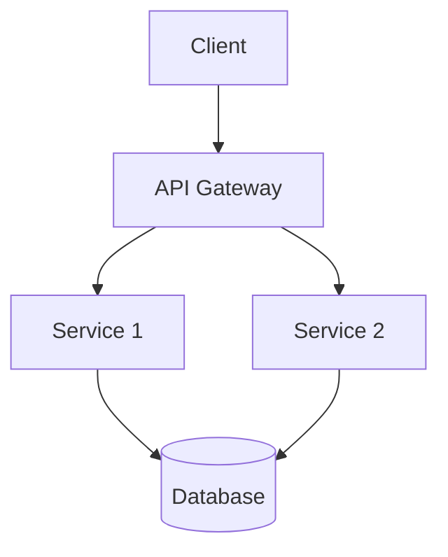
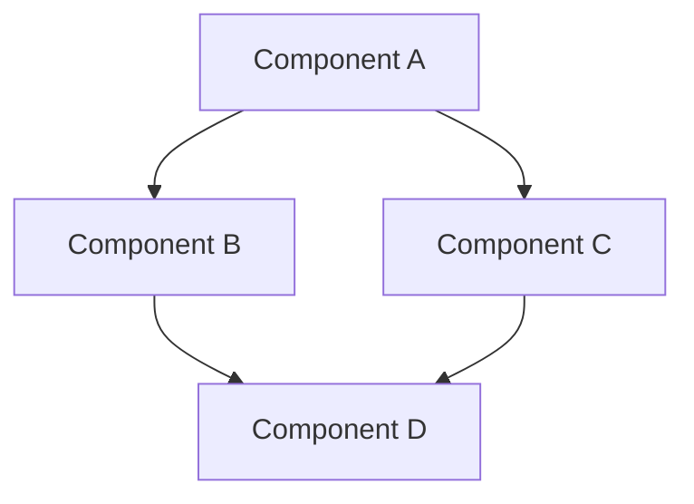

# 📚 README Documentation Guidelines

This document outlines our standards and best practices for creating README files across all projects. Following these guidelines ensures consistency, improves documentation quality, and enhances user experience.

## 🎯 Core Principles

1. **Clarity First** 🔍: Documentation should be clear, concise, and accessible to the intended audience.
2. **Visual Appeal** 🎨: Use visual elements to enhance understanding and engagement.
3. **Comprehensive Coverage** 📋: Include all necessary information for users to understand and use the project.
4. **Hierarchical Structure** 🏗️: Organize information in a logical hierarchy with clear sections.

## 📝 Required Elements

### 1. Project Title and Description

- **Title**: Use a clear, descriptive title with an appropriate emoji
- **Short Description**: 1-2 sentences explaining what the project does
- **Badges**: Include relevant badges (build status, version, license)

Example:

# 🚀 Project Name

📱 A mobile application that helps users track their daily water intake and stay hydrated.

[](https://travis-ci.org/username/project)
[](https://www.npmjs.com/package/project)
[](LICENSE)

### 2. Visual Elements

#### Mermaid Diagrams

**Always include at least one Mermaid diagram** to visualize:
- Architecture
- Workflows
- Data flow
- Component relationships

Example:

## 🏗️ Architecture



#### Screenshots and GIFs

Include screenshots or GIFs demonstrating:
- UI components
- User workflows
- Key features in action

Example:

## 📸 Screenshots

| Home Screen | Settings | Dashboard |
|-------------|----------|-----------|
|  |  |  |

### 3. Emojis

**Use emojis liberally** to enhance readability and visual appeal:

- Section headers should always include a relevant emoji
- Feature lists should use emojis as bullet points or prefixes
- Status indicators can use emojis (✅ success, ❌ failure, etc.)

Recommended emojis for common sections:
- 🚀 Getting Started
- 🔧 Installation
- 🏗️ Architecture
- ✨ Features
- 📚 Documentation
- 🧪 Testing
- 🤝 Contributing
- 📄 License

### 4. Rich Markdown Formatting

Utilize the full range of markdown features:

#### Tables

Use tables for:
- Feature comparisons
- API endpoints
- Configuration options
- Command references

Example:

| Command | Description | Example |
|---------|-------------|---------|
| `init` | Initialize the project | `project init --name=example` |
| `build` | Build the project | `project build --env=prod` |

#### Collapsible Sections

Use for detailed information that not all users need:

<details>
<summary>🔍 Advanced Configuration Options</summary>

## Advanced Options

Detailed explanation of advanced configuration options...

</details>

#### Code Blocks

Always use syntax highlighting for code examples:

```javascript
function example() {
  const data = fetchData();
  return processData(data);
}
```

#### Callouts

Use blockquotes with emojis for important notes:

> ⚠️ **Warning**: This feature is experimental and may change in future versions.

> 💡 **Tip**: You can speed up this process by using the `--cache` flag.

## 📂 README Hierarchy

### Main README.md

The root README.md should provide:
- Project overview
- Quick start guide
- Architecture overview
- Links to more detailed documentation

### Subdirectory READMEs

Create README.md files in subdirectories when:
- The subdirectory contains a logical component or module
- Users might need specific information about that component
- The component has its own installation or usage instructions

Example directory structure with READMEs:
```
project/
├── README.md                 # Main project README
├── docs/
│   ├── README.md             # Documentation overview
│   ├── api-reference.md
│   └── tutorials/
│       └── README.md         # Tutorials overview
├── frontend/
│   ├── README.md             # Frontend-specific documentation
│   └── components/
│       └── README.md         # Component documentation
└── backend/
    └── README.md             # Backend-specific documentation
```

## 📋 README Template

# 🚀 Project Name

📱 Short description of the project.

[](link)
[](link)

## 🌟 Overview

Detailed description of what the project does and why it exists.

## 🏗️ Architecture



## ✨ Features

- ⚡ Feature 1: Description
- 🔒 Feature 2: Description
- 🔄 Feature 3: Description

## 🚀 Getting Started

### 📋 Prerequisites

- Requirement 1
- Requirement 2

### 🔧 Installation

```bash
# Installation steps
npm install my-project
```

## 📖 Usage

```javascript
// Usage example
const project = require('my-project');
project.doAwesomeThing();
```

## 🧪 Testing

```bash
npm test
```

## 🤝 Contributing

Contributions are welcome! Please feel free to submit a Pull Request.

## 📄 License

This project is licensed under the [LICENSE NAME](LICENSE) - see the LICENSE file for details.

## 🔍 Review Checklist

Before finalizing a README, ensure it:

- [ ] Includes at least one Mermaid diagram
- [ ] Uses emojis for all section headers
- [ ] Contains screenshots or GIFs for visual projects
- [ ] Provides clear installation and usage instructions
- [ ] Utilizes tables, code blocks, and other rich formatting
- [ ] Has proper hierarchy with subdirectory READMEs where appropriate
- [ ] Includes links to additional documentation
- [ ] Has been checked for spelling and grammar errors

## 🌟 Examples of Excellent READMEs

- [Example Project 1](https://github.com/example/project1)
- [Example Project 2](https://github.com/example/project2)

Following these guidelines will ensure our documentation is consistent, informative, and visually appealing across all projects.
