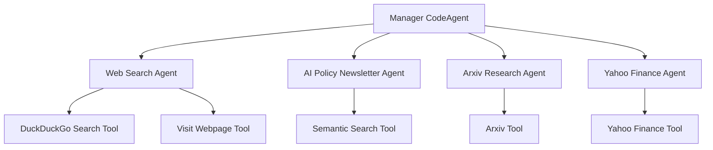

# 🔍 Smolagent Researcher

🤖 A powerful AI research assistant built with the smolagents framework that helps with research tasks across multiple domains including AI policy, technical research, and macroeconomics.

## 🌟 Overview

Smolagent Researcher is a multi-agent system that leverages specialized tools to perform comprehensive research tasks. The system uses a manager agent (CodeAgent) that coordinates multiple specialized agents to gather information from various sources including web searches, academic papers, financial data, and curated newsletters.

## 🏗️ Architecture



### 🧩 Components

1. **Manager Agent** 🧠: A CodeAgent that coordinates the specialized agents and processes their results
2. **Specialized Agents** 🤖: ToolCallingAgents that focus on specific research domains
3. **Custom Tools** 🛠️: Tools for accessing specialized data sources
4. **FastAPI Interface** 🚀: API endpoints for interacting with the system
5. **Gradio UI** 🖥️: Optional web interface for interacting with the system

## 🤖 Available Agents

| Agent | Description | Tools |
|-------|-------------|-------|
| Web Search Agent | Performs web searches and visits webpages | DuckDuckGoSearchTool, VisitWebpageTool |
| AI Policy Newsletter Agent | Searches curated newsletters on AI policy, geopolitics, and security | Semantic search tool with Pinecone vector database |
| Arxiv Research Agent | Searches academic papers on Arxiv | Arxiv tool from LangChain |
| Yahoo Finance Agent | Retrieves financial data for publicly traded companies | Yahoo Finance tool |

## ✨ Features

- **Multi-agent coordination** 🧠: Manager agent delegates tasks to specialized agents
- **Customized prompts** 📝: Enhanced system prompts for better agent performance
- **Telemetry and monitoring** 📊: Integration with Phoenix for tracking agent performance
- **Multiple interfaces** 🖥️: API endpoints and optional Gradio UI
- **Vector search** 🔍: Semantic search for curated newsletters
- **Academic research** 📚: Integration with Arxiv for academic papers
- **Financial data** 💹: Integration with Yahoo Finance for company data

## 🚀 Setup

### 📋 Prerequisites

- Python 3.10+ 🐍
- Poetry (for dependency management) 📦
- API keys for:
  - Anthropic (Claude) 🤖
  - Pinecone 🌲
  - OpenAI (for embeddings) 🧠

### 💻 Installation

1. Clone the repository 📥
2. Install dependencies:
   ```bash
   poetry install
   ```
3. Create a `.env` file with the following variables:
   ```
   ANTHROPIC_API_KEY=your_anthropic_api_key
   PINECONE_API_KEY=your_pinecone_api_key
   PINECONE_INDEX_NAME=your_pinecone_index_name
   PINECONE_NAMESPACE=your_pinecone_namespace
   PHOENIX_PROJECT_NAME=your_phoenix_project_name
   ```

### 🚀 Running the API

```bash
poetry run uvicorn main:app --reload
```

### 🖥️ Running the Gradio UI (Optional)

```bash
poetry run python gradio_ui.py
```

## 🔌 API Endpoints

The system provides several API endpoints for different research domains:

- `/ai_policy_agent` 📜: For AI policy and governance research
- `/ai_technical_agent` 💻: For technical AI research
- `/global_macroeconomic_agent` 📈: For macroeconomic research

### 📝 Example Request

```bash
curl -X POST "http://localhost:8000/ai_policy_agent" \
     -H "Content-Type: application/json" \
     -d '{"task": "Research the latest developments in AI safety regulations in the EU"}'
```

## 🛠️ Customization

### 🧰 Adding New Tools

You can add new tools by:

1. Creating a new function with the `@tool` decorator in `tools.py`
2. Adding the tool to an existing agent or creating a new agent in `agent.py`

Example:
```python
@tool
def new_research_tool(query: str) -> str:
    """
    Description of what this tool does.
    
    Args:
        query: The query to search for.
    """
    # Implementation
    return "Results..."
```

### 📝 Modifying Agent Prompts

Agent prompts can be customized by editing the `modified_toolcalling_agent.yaml` file.

## 👥 Contributing

Contributions are welcome! Please feel free to submit a Pull Request. 🙌

## 📄 License

This project is licensed under the MIT License - see the LICENSE file for details. ⚖️
