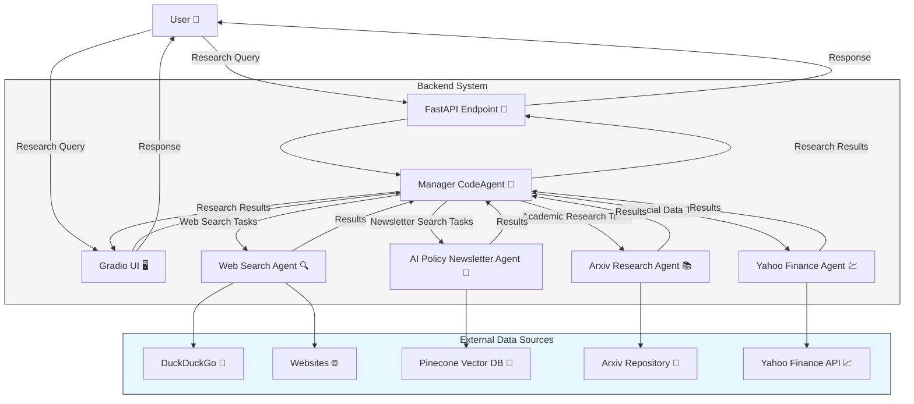
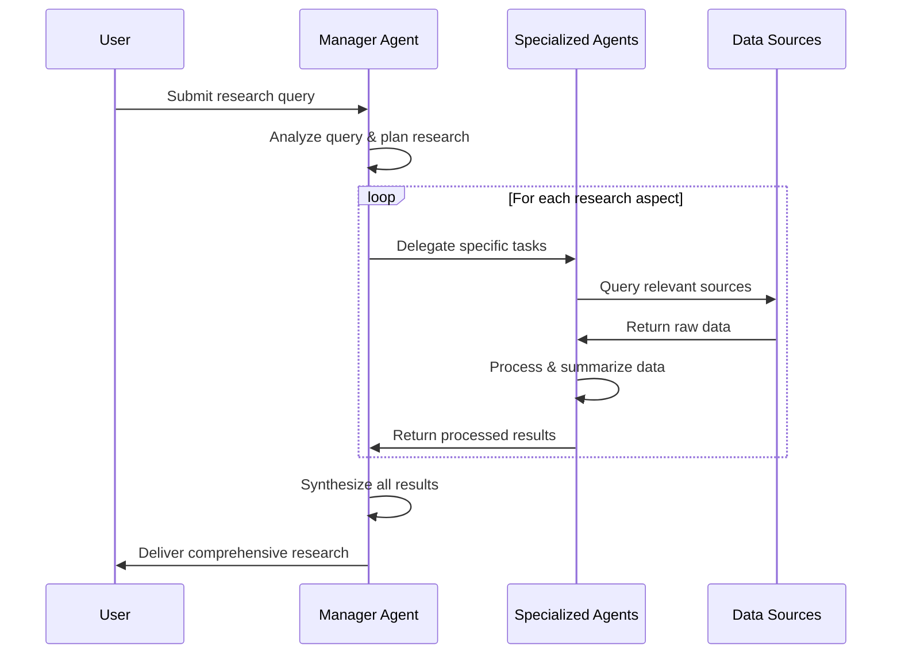
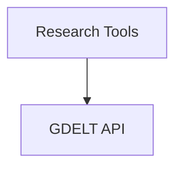

# 🔍 Smolagent Researcher

[](https://www.python.org/downloads/)
[](https://fastapi.tiangolo.com)
[](https://opensource.org/licenses/MIT)
[](https://github.com/smolagents/smolagents)

🤖 A powerful AI research assistant built with the smolagents framework that helps with research tasks across multiple domains including AI policy, technical research, and macroeconomics.

## 🌟 Overview

Smolagent Researcher is a multi-agent system that leverages specialized tools to perform comprehensive research tasks. The system uses a manager agent (CodeAgent) that coordinates multiple specialized agents to gather information from various sources including web searches, academic papers, financial data, and curated newsletters.

The system is designed to provide in-depth research capabilities across different domains, making it ideal for researchers, analysts, and decision-makers who need comprehensive information gathering and synthesis.

## 🏗️ Architecture



### 🔄 Research Workflow



## 🧩 System Components

### 1. 🧠 Manager Agent

The Manager Agent is a CodeAgent that:
- Analyzes research queries to determine required information
- Delegates specific research tasks to specialized agents
- Synthesizes information from all sources into a coherent response
- Handles planning and coordination of the research process

### 2. 🤖 Specialized Agents

| Agent | Description | Tools | Data Sources |
|-------|-------------|-------|--------------|
| 🔍 Web Search Agent | Performs web searches and visits webpages for general information | DuckDuckGoSearchTool, VisitWebpageTool | DuckDuckGo, Public websites |
| 📰 AI Policy Newsletter Agent | Searches curated newsletters on AI policy, geopolitics, and security | Semantic search tool | Pinecone vector database |
| 📚 Arxiv Research Agent | Searches academic papers for technical and scientific information | Arxiv tool | Arxiv repository |
| 💹 Yahoo Finance Agent | Retrieves financial data for publicly traded companies | Yahoo Finance tool | Yahoo Finance API |

### 3. 🛠️ Custom Tools

<details>
<summary>Click to expand tool details</summary>

#### Web Search Tools
- **DuckDuckGoSearchTool**: Performs web searches using DuckDuckGo
- **VisitWebpageTool**: Visits and extracts content from webpages

#### Semantic Search Tool
- **ai_policy_geopolitics_semantic_search**: Searches a vector database of curated newsletters
- Uses Pinecone for vector storage and OpenAI embeddings for semantic matching

#### Academic Research Tool
- **arxiv_tool**: Searches academic papers on Arxiv
- Converted from LangChain's Arxiv tool

#### Financial Data Tool
- **yahoo_finance_search**: Retrieves financial data for publicly traded companies
- Uses Yahoo Finance API to get company information

</details>

### 4. 🚀 API Interface

FastAPI-based API with endpoints for different research domains:
- `/ai_policy_agent`: For AI policy and governance research
- `/ai_technical_agent`: For technical AI research
- `/global_macroeconomic_agent`: For macroeconomic research

### 5. 🖥️ Gradio UI

Optional web interface for interacting with the system, providing a user-friendly way to submit research queries and view results.

## ✨ Features

- ⚡ **Multi-agent coordination**: Manager agent intelligently delegates tasks to specialized agents
- 🔍 **Comprehensive research**: Gathers information from multiple sources for thorough analysis
- 🧠 **Intelligent synthesis**: Combines information from different sources into coherent responses
- 📝 **Customized prompts**: Enhanced system prompts for better agent performance
- 📊 **Telemetry and monitoring**: Integration with Phoenix for tracking agent performance
- 🌐 **Multiple interfaces**: API endpoints and optional Gradio UI
- 🔍 **Vector search**: Semantic search for curated newsletters on AI policy
- 📚 **Academic research**: Integration with Arxiv for scientific papers
- 💹 **Financial data**: Integration with Yahoo Finance for company information
- 🌐 **GDELT access**: Query global event and entity data via GDELT v2/v3 APIs

## 🌐 GDELT Integration




```python
from gdelt_v2 import query_doc
res = await query_doc(query="Ukraine", start="20250101000000", end="20250102000000")
```

- [Official GDELT Documentation](https://www.gdeltproject.org/)

## 🚀 Getting Started

### 📋 Prerequisites

- Python 3.10+ 🐍
- Poetry (for dependency management) 📦
- API keys for:
  - Anthropic (Claude Sonnet 4 - 20250514) 🤖
  - Pinecone 🌲
  - OpenAI (for embeddings) 🧠

### 🔧 Installation

1. Clone the repository 📥
   ```bash
   git clone https://github.com/yourusername/smolagent-researcher.git
   cd smolagent-researcher
   ```

2. Install dependencies 📦
   ```bash
   poetry install
   ```

3. Create a `.env` file with your API keys 🔑
   ```
   ANTHROPIC_API_KEY=your_anthropic_api_key
   PINECONE_API_KEY=your_pinecone_api_key
   PINECONE_INDEX_NAME=your_pinecone_index_name
   PINECONE_NAMESPACE=your_pinecone_namespace
   PHOENIX_PROJECT_NAME=your_phoenix_project_name
   ```

### 🚀 Quick Start

Run the API server:
```bash
poetry run uvicorn main:app --reload
```

Or run the Gradio UI:
```bash
poetry run python gradio_ui.py
```

> 💡 **Tip**: The Gradio UI provides a more user-friendly interface for testing and using the system.

## 🔌 API Usage

### API Endpoints

| Endpoint | Description | Example Query |
|----------|-------------|---------------|
| `/ai_policy_agent` | Research on AI policy and governance | "Analyze recent EU AI regulations" |
| `/ai_technical_agent` | Technical AI research | "Explain recent advances in LLM training" |
| `/global_macroeconomic_agent` | Macroeconomic research | "Analyze inflation trends in the US" |

### 📝 Example Request

```bash
curl -X POST "http://localhost:8000/ai_policy_agent" \
     -H "Content-Type: application/json" \
     -d '{"task": "Research the latest developments in AI safety regulations in the EU"}'
```

### 📝 Example Response

<details>
<summary>Click to view example response</summary>

```json
{
  "output": "# Latest Developments in AI Safety Regulations in the EU\n\n## Summary\nThe EU has recently finalized the AI Act, the world's first comprehensive AI regulation. Key provisions include:\n\n- Risk-based approach categorizing AI systems based on potential harm\n- Strict regulations for high-risk AI applications\n- Ban on certain AI uses like social scoring\n- Transparency requirements for AI systems\n- Heavy penalties for non-compliance\n\n## Timeline\n- March 2024: Final approval by European Parliament\n- Expected implementation: Late 2024 to early 2025\n- Two-year transition period for most provisions\n\n## Key Requirements\n1. **Risk Categories**:\n   - Unacceptable risk: Banned applications\n   - High risk: Strict requirements\n   - Limited risk: Transparency obligations\n   - Minimal risk: Minimal regulation\n\n2. **High-Risk System Requirements**:\n   - Risk assessment and mitigation\n   - High quality datasets\n   - Detailed documentation\n   - Human oversight\n   - Robustness and accuracy\n\n3. **Foundation Model Provisions**:\n   - Additional transparency requirements\n   - Technical documentation\n   - Copyright compliance\n\n## Industry Impact\nCompanies developing or deploying AI in the EU will need to:\n- Implement compliance programs\n- Document AI systems thoroughly\n- Conduct risk assessments\n- Ensure transparency in AI operations\n\n## Sources\n1. European Commission official documents\n2. Recent analysis from AI policy newsletters\n3. Academic papers on regulatory approaches\n4. Industry responses from major AI companies"
}
```

</details>

## 🛠️ Customization

### 🧰 Adding New Tools

You can extend the system by adding new tools for specialized research tasks:

1. Create a new function with the `@tool` decorator in `tools.py`:

```python
@tool
def new_research_tool(query: str) -> str:
    """
    Description of what this tool does.
    
    Args:
        query: The query to search for.
    """
    # Implementation
    return "Results..."
```

2. Add the tool to an existing agent or create a new agent in `agent.py`:

```python
new_agent = CustomToolCallingAgent(
    tools=[new_research_tool],
    model=claude_llm,
    max_steps=5,
    name="new_research_agent",
    description="Description of what this agent does."
)

# Add to manager agent
manager_agent = CodeAgent(
    tools=[],
    model=claude_llm,
    managed_agents=[web_agent, newsletter_agent, arxiv_agent, yahoo_finance_agent, new_agent],
    additional_authorized_imports=["time", "numpy", "pandas"],
    planning_interval=2
)
```

### 📝 Modifying Agent Prompts

Agent prompts can be customized by editing the `modified_toolcalling_agent.yaml` file. This allows you to:

- Change the system prompt for agents
- Modify planning strategies
- Adjust how agents process and respond to tasks

### 🔄 Adding New Data Sources

To add new data sources:

1. Create a new tool that interfaces with the data source
2. Create a new agent that uses the tool
3. Add the agent to the manager agent

## 🧪 Testing and Evaluation

> ⚠️ **Note**: Thorough testing is essential for ensuring research quality and accuracy.

Test your research system with:

1. **Unit tests** for individual tools and agents
2. **Integration tests** for the complete system
3. **Evaluation metrics** for research quality:
   - Relevance of information
   - Comprehensiveness
   - Accuracy
   - Response time

## 🔍 Troubleshooting

<details>
<summary>Common Issues and Solutions</summary>

### API Key Issues
- **Problem**: "Authentication failed" errors
- **Solution**: Double-check your API keys in the `.env` file

### Rate Limiting
- **Problem**: "Too many requests" errors
- **Solution**: Implement rate limiting or use API key rotation

### Memory Issues
- **Problem**: System crashes with large research tasks
- **Solution**: Adjust the `max_tokens` parameter in the LLM configuration

### Timeout Issues
- **Problem**: Research tasks timing out
- **Solution**: Increase timeout settings or break complex tasks into smaller steps

</details>

## 👥 Contributing

Contributions are welcome! Please feel free to submit a Pull Request. 🙌

### Contribution Guidelines

1. Fork the repository
2. Create a feature branch (`git checkout -b feature/amazing-feature`)
3. Commit your changes (`git commit -m 'Add some amazing feature'`)
4. Push to the branch (`git push origin feature/amazing-feature`)
5. Open a Pull Request

## 📄 License

This project is licensed under the MIT License - see the LICENSE file for details. ⚖️

## 🔍 Review Checklist

- [x] Includes multiple Mermaid diagrams
- [x] Uses emojis for all section headers
- [x] Contains detailed architecture information
- [x] Provides clear installation and usage instructions
- [x] Utilizes tables, code blocks, and other rich formatting
- [x] Includes API documentation
- [x] Has been checked for spelling and grammar errors
