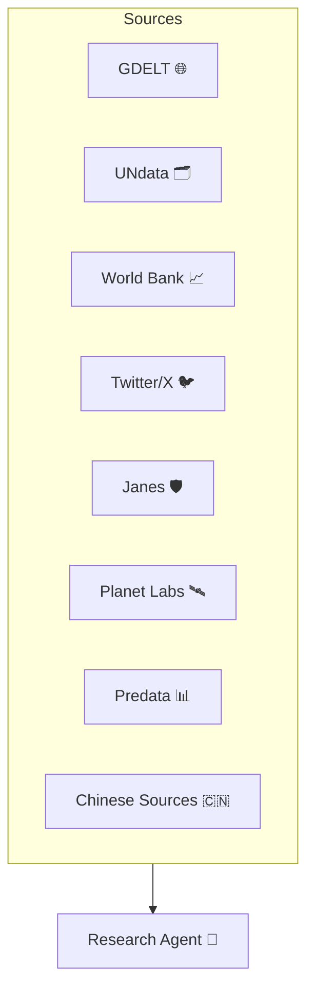

# 🚀 Data Source Integration Roadmap

This TODO list tracks data sources that need to be wired into the agent as individual tools. Each source will become a tool that can be invoked by our agents. "Foundational" feeds are free or open, while "Differentiated" feeds may require subscriptions or extra effort.

## 1️⃣ Geopolitical Intelligence Platform

### Foundational
1. [ ] GDELT v2/v3 global event database
2. [ ] UNdata SDMX API
3. [ ] World Bank Open Data & Documents APIs
4. [ ] Twitter/X, Reddit, RSS aggregators, NewsAPI

### Differentiated / Premium
1. [ ] Janes Defence & Security Intelligence
2. [ ] Planet Labs daily imagery
3. [ ] Predata or SimilarWeb geopolitical indices
4. [ ] People’s Daily & State Council Gazette

## 2️⃣ AI‑Powered Macroeconomic Analysis Tool

### Foundational
1. [ ] FRED® API
2. [ ] IMF WEO & OECD stats
3. [ ] BEA & BLS public APIs

### Differentiated / Premium
1. [ ] Haver Analytics
2. [ ] Bloomberg Terminal or Refinitiv Datastream
3. [ ] SafeGraph foot‑traffic / card‑spend
4. [ ] NASA VIIRS nighttime‑lights

## 3️⃣ AI‑Enhanced Cultural Trend Analysis (China‑centric)

### Foundational
1. [ ] Sina Weibo API
2. [ ] Baidu Index
3. [ ] Google Trends
4. [ ] Reddit & Discord API scrapes

### Differentiated / Premium
1. [ ] QuestMobile micro‑panel
2. [ ] Brandwatch Consumer Research
3. [ ] Kantar MONITOR surveys
4. [ ] Sensor Tower

## 4️⃣ AI‑Based Defense Technology Tracker

### Foundational
1. [ ] USPTO & EPO open patent APIs
2. [ ] Google Patents BigQuery dataset
3. [ ] arXiv & IEEE Xplore RSS
4. [ ] SIPRI Arms‑Transfer database

### Differentiated / Premium
1. [ ] Janes Defence Equipment & Forecasts
2. [ ] GlobalData or RAND briefs
3. [ ] Planet / Maxar high‑resolution tasking
4. [ ] CNIPA + SIPO patents & RavenPack sentiment

## 5️⃣ Investment Strategy Simulator

### Foundational
1. [ ] Yahoo Finance via `yfinance`
2. [ ] SEC EDGAR filings API
3. [ ] CoinGecko public API
4. [ ] FRED data

### Differentiated / Premium
1. [ ] WRDS / CRSP
2. [ ] RavenPack News Sentiment
3. [ ] High‑frequency tick data & alt‑data
4. [ ] Bloomberg B‑pipe

